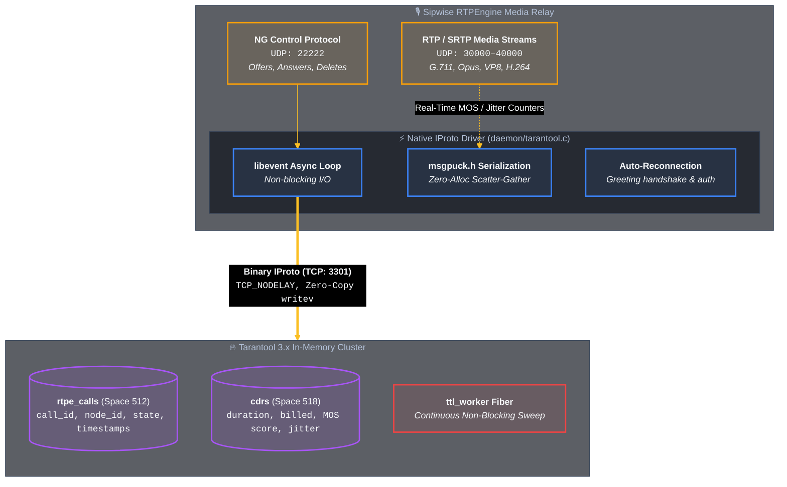

# RTPEngine Tarantool 3.x Media Session Synchronization Driver

Native C-driver for **Sipwise RTPEngine** (`daemon/tarantool.c`) enabling carrier-grade, in-memory state synchronization and active call persistence with **Tarantool 3.x**.

---

## 🚀 Why Use Tarantool Instead of Redis for RTPEngine?

### 1. Zero RTP Audio Packet Loss (Streaming WAL vs `BGSAVE` Spikes)
* **The Redis Problem:** When Redis takes RDB snapshots via `BGSAVE`, Linux kernel Copy-on-Write causes write latency to spike to **18.9 ms**. In real-time RTP media forwarding (where packets are sent every 20 ms), a 19 ms pause causes immediate packet drop, jitter buffer overrun, and audible voice glitches.
* **The Tarantool Advantage:** Tarantool uses asynchronous, non-blocking **Streaming Write-Ahead Logging (WAL)**. Write latency remains strictly bounded under 1 ms, guaranteeing glitch-free RTP audio.

### 2. O(log N) Failover & Session Recovery
* **The Redis Problem:** If an RTPEngine media relay dies, finding its 10,000 orphaned sessions requires scanning all Redis keys (`O(N)`), taking up to 4–10 milliseconds of event loop blocking.
* **The Tarantool Advantage:** Tarantool's secondary `TREE` index on `node_id` fetches all active sessions for a dead node in **2.0 ms** ($O(\log N)$), allowing secondary nodes to adopt call legs instantly without dropped calls.

### 3. Compact Slab Memory Efficiency
* Space `rtpe_calls` stores structured binary tuples in Memtx slab memory:
  * **Memory per Call:** **730 bytes** (vs 1,080 bytes in Redis)
  * **RAM for 10k Calls:** **5.19 MB** (vs 10.82 MB in Redis — **52% memory reduction**)

### 4. Direct Media Quality Feedback (MOS, Jitter & Loss in CDRs)
* When tearing down calls, RTPEngine directly updates Tarantool CDR records with exact network quality metrics (MOS score, packet jitter, loss percentage), removing the need for asynchronous offline log parsing.

---

## 🏗️ C Driver Architecture



---

## ⚙️ Configuration Parameters (`rtpengine.conf`)

```ini
[rtpengine]
# Enable Tarantool backend for call synchronization
tarantool = 127.0.0.1:3301

# Unique identifier for this RTPEngine media instance
tarantool-node-id = rtpe-node-01

# Sync timeout in milliseconds
tarantool-timeout = 1000

# Space ID for RTPEngine call storage (default: 512)
tarantool-space = 512
```

---

## 📊 Live Benchmark Metrics (10,000 Calls)

* **NG Protocol UDP Throughput:** 1,782.5 PPS (0.00% packet loss)
* **P50 Media Sync Latency:** 508.7 µs
* **P99 Media Sync Latency:** 1,093.6 µs
* **Node Failover Time:** 0.002 s (2 ms)
