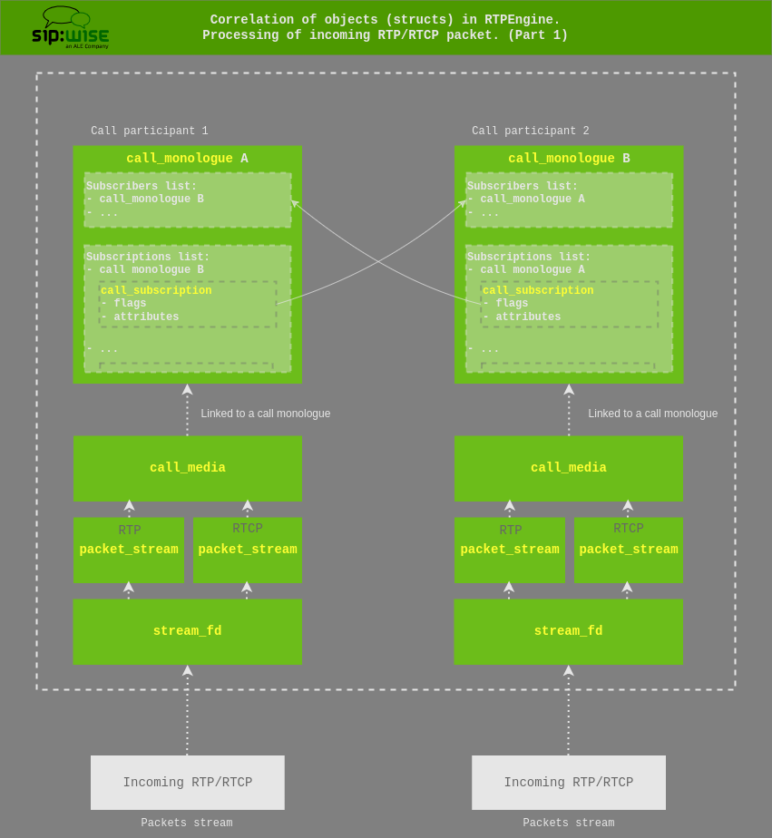
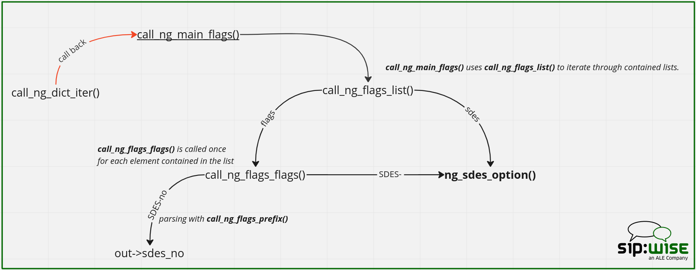

Architecture Overview
=====================

Processing of RTP/RTCP packets
------------------------------

An incoming RTP is initially received by the `stream_fd`, which directly links it to the correlated `packet_stream`.

Each `packet_stream` then links to an upper-level `call_media` — generally there are two `packet_stream` objects per `call_media`, one for RTP and one for RTCP. The `call_media` then links to a `call_monologue`, which corresponds to a participant of the call.

The handling of packets is implemented in `media_socket.c` and always starts with the `stream_packet()`.

This operates on the originating `stream_fd` (fd which received the packet) and on its linked `packet_stream` and eventually proceeds to going through the list of sinks, either `rtp_sink`s or `rtcp_sink`s (egress handling) and uses the contained `sink_handler` objects, which points to the destination `packet_stream`, see:

`stream_fd -> packet_stream -> list of sinks -> sink_handler -> dst packet_stream`

**To summarize, RTP/RTCP packet forwarding then consists of:**
* Determining whether to use `rtp_sink`s or `rtcp_sink`s
* Iterating this list, which is a list of `sink_handler` objects
* Each sink handler has an output `packet_stream` and a `streamhandler`
* Calling the stream handler's input function to decrypt, if needed (but, [a nuance](#appendix-1))
* Checking the RTP payload type and calling the codec handler, if there is one (e.g. for transcoding)
* Calling the `streamhandler`'s output function to encrypt, if needed
* Sending the packet out to the output packet stream
* Repeat

### appendix 1 ###
In practice the stream handler's input function (step 4) is called only once, before going into the loop to send packets to their destinations.

The reason for that — there's a duplication of input functions in the stream handlers, this is:
1. Legacy, because previously used to have a single output for each packet stream (and this part hasn't been rewritten yet)
2. Theoretically it's possible to save the effort of re-encrypting SRTP > SRTP forwarding, if some of the outputs are plain RTP, meanwhile other outputs are SRTP pass-through (but that part isn't implemented).

As for setting up the kernel's forwarding chain: It's basically the same process of going through the list of sinks and building up the structures for the kernel module, with the sink handlers taking up the additional role of filling in the structures needed for decryption and encryption.

### Other important notes: ###

**Incoming packets (ingress handling):**\
`sfd->socket.local`: the local IP/port on which the packet arrived\
`sfd->stream->endpoint`: adjusted/learned IP/port from where the packet was sent\
`sfd->stream->advertised_endpoint`: the unadjusted IP/port from where the packet was sent. These are the values present in the SDP

**Outgoing packets (egress handling)**:\
`sfd->stream->rtp_sink->endpoint`: the destination IP/port\
`sfd->stream->selected_sfd->socket.local`: the local source IP/port for the outgoing packet

**Handling behind the NAT**:\
If rtpengine runs behind the NAT and local addresses are configured with different advertised endpoints,\
the SDP would not contain the address from `...->socket.local`, but rather from `sfd->local_intf->spec->address.advertised` (of type `sockaddr_t`).\
The port will be the same.

**Binding to sockets**:\
Sockets aren't indiscriminately bound to INADDR_ANY (or rather in6addr_any),\
but instead are always bound to their respective local interface address and with the correct address family.

Side effects of this are that in multi-homed environments, multiple sockets must be opened\
(one per interface address and family), which must be taken into account when considering RLIMIT_NOFILE values.\
As a benefit, this change allows rtpengine to utilize the full UDP port space per interface address, instead of just one port space per machine.

### Marking the packet stream ###

The `packet_stream` itself (or the upper-level `call_media`) can be marked as:
* SRTP endpoint
* ICE endpoint
* send/receive-only

This is done through the `transport_protocol` element and various bit flags.\
Currently existing transport_protocols:
* RTP AVP
* RTP SAVP
* RTP AVPF
* RTP SAVPF
* UDP TLS RTP SAVP
* UDP TLS RTP SAVPF
* UDPTL
* RTP SAVP OSRTP
* RTP SAVPF OSRTP

For more information about the RTP packets processing see [RTP packets processing](#rtp-packets-processing-additional-information) of the _“Mutexes, locking, reference counting”_ section.

---

Call monologue and handling of call subscriptions
-------------------------------------------------

Each `call_monologue` (call participant) contains a list of subscribers and subscriptions,\
which are other `call_monologue`'s. These lists are mutual.\
A regular A/B call has two `call_monologue` objects with each subscribed to the other.\
So that, one `call_monologue` = half of a dialog.

Subscribers of certain monologue — are other monologues, which will receive the media sent by the source monologue.

The list of subscriptions is a list of `call_subscription` objects which contain flags and attributes.

_NOTE: Flags and attributes can be used, for example, to mark a subscription as an egress subscription._



_On the diagram above you can clearly see how monologues and hence subscriptions are correlated._

A handling of call subscriptions is implemented in the `call.c` file.\
In this regard, one of the most important functions here is `__add_subscription()`.

A transfer of flags/attributes from the subscription (`call_subscription`) to the correlated sink handlers (`sink_handler` objects list) is done using the `__init_streams()` through the `__add_sink_handler()`.

---

Signaling events
----------------

During signalling events (e.g. offer/answer handshake), the list of subscriptions for each `call_monologue` is used to create the list of `rtp_sink` and `rtcp_sink` sinks given in each `packet_stream`. Each entry in these lists is a `sink_handler` object, which again contains flags and attributes.

_NOTE: ‘sink’ - is literally a sink, as in drain. Basically an output or destination for a media/packet stream._

During the execution, the function `__update_init_subscribers()` goes through the list of subscribers,\
through each media section and each packet stream, and sets up the list of sinks for each packet stream, via `__init_streams()`.

This populates the list of `rtp_sinks` and `rtcp_sinks` for each packet stream.

Flags and attributes from the `call_subscription` objects are copied into the according sink_handler object(s).\
During actual packet handling and forwarding, only the `sink_handler` objects (and the packet_stream objects they related to) are used, not the `call_subscription` objects.

Processing of signaling event (offer/answer) to rtpengine,\
in terms of using functionality looks as following (for one `call_monologue`):

* signaling event begins (offer / answer)
* `monologue_offer_answer()` -> `__get_endpoint_map()` -> `stream_fd_new()`
* in `stream_fd_new()` we initialize a new poller item (`poller_item`),\
and then using the `stream_fd_readable()`, the `pi.readable` member is set:
```
pi.readable = stream_fd_readable;
```
* in the `main.h` header, there is a globally defined poller, to which we add a newly initialized poller item, like this:
```
struct poller *p = rtpe_poller;
poller_add_item(p, &pi);
```
* poller will be used to later destroy this reference-counted object
* later, the `stream_fd_readable()` in its turn, will trigger the `stream_packet()` for RTP/RTCP packets processing
* `monologue_offer_answer()` now continues processing and calls `update_init_subscribers()` to go through the list of subscribers (through related to them media and each packet stream) and using `__init_streams()` sets up sinks for each stream.


Then, each `sink_handler` points to the correlated egress packet_stream and also to the `streamhandler`.\
The `streamhandler` in its turn is responsible for handling an encryption, primarily based on the transport protocol used.

There's a matrix (a simple lookup table) of possible stream handlers in `media_socket.c`, called `__sh_matrix`.\
Stream handlers have an input component, which would do decryption, if needed, as well as an output component for encryption.

For more information regarding signaling events, see [Signaling events, additional information](#signaling-events-additional-information) of the _“Mutexes, locking, reference counting”_ section.

---

Mutexes, locking, reference counting
------------------------------------

### Struct call ###

The main parent structure of all call-related objects (packet streams, media sections, sockets and ports, codec handlers, etc) is the struct `call`. Almost all other structures and objects are nested underneath a call.


The `call` structure contains a master read-write lock: `rwlock_t master_lock`, that protects the entire call and all contained objects.

With the exception of a few read-only fields, all fields of `call` and any nested sub-object **must** only be accessed with the `master_lock` held as a read lock, and **must** only be modified with the `master_lock` held as a write lock.

The rule of thumb therefore is: during signalling events acquire a write-lock, and during packet handling acquire a read-lock.

### Object/struct hierarchy and ownership ###

The logical object hierarchy is `call` → `call_monologue` → `call_media` → `packet_stream` → `stream_fd`.\
Each parent object can contain multiple of the child objects (e.g. multiple `call_media` per `call_monologue`) and\
each child object contains a back pointer to its parent object. Some objects contain additional back pointers for convenience, e.g. from `call_media` directly to `call`. These are not reference counted as the child objects are entirely owned by the `call`,\
with the exception of `stream_fd` objects.

The parent `call` object contains one list (as `GQueue`) for each kind of child object.\
These lists exist for convenience, but most importantly as primary containers. Every child object owned by the `call` is added to its respective list exactly once, and these lists are what is used to free and release the child objects during call teardown.\
Additionally most child objects are given a unique numeric ID (`unsigned int unique_id`) and it’s the position in the `call`’s `GQueue` that determines the value of this ID (which is unique per call and starts at zero).

### Reference-counted objects ###

Call objects are reference-counted through the `struct obj` contained in the `call`.

The struct `obj` member must always be the first member in a struct. Each `obj` is created with a cleanup handler (see `obj_alloc()`) and this handler is executed whenever the reference count drops to zero. References are acquired and released through `obj_get()` and `obj_put()` (plus some other wrapper functions).

The code bases uses the “entry point” approach for references, meaning that each entry point into the code (coming from an external trigger, such as a received command or packet) must hold a reference to some reference-counted object.

### Signaling events additional information ###

The main entry point into call objects for signalling events is the call-ID:\
therefore the main entry point is the global hash table `rtpe_callhash` (protected by `rtpe_callhash_lock`),\
which uses call-IDs as keys and `call` objects as values, while holding a reference to each contained call. The function `call_get()` and its sibling functions perform the lookup of `call` via its call-ID and return a new reference to the `call` object (i.e. with the reference count increased by one).

Therefore the code must use `obj_put()` on the `call` after `call_get()` and after it's done operating on the object.

### RTP packets processing additional information ###

Another entry point into the code is RTP packets received on a media port. Media ports are contained in a struct `stream_fd` and because this is also an entry-point object, it is also reference counted (contains a struct `obj`).

_NOTE: The object responsible for maintaining and holding the entry-point references is the poller._

Each `stream_fd` object also holds a reference to the `call` it belongs to\
(which in turn holds references to all `stream_fd` objects it contains, which makes these circular references).\
Therefore `stream_fd` objects are only released, when they’re removed from the `poller` and also removed from the call (and conversely, the `call` is only released when it has been dissociated from all `stream_fd` objects, which happens during call teardown).

### Non-reference-counted objects ###

Other structs and objects nested underneath a `call` (e.g. `call_media`) are not reference counted as they're not entry points into the code, and accordingly also don’t hold references to the `call` even though they contain pointers to it.\
These are completely owned by the `call` and are therefore released when the `call` is destroyed.

### Packet_stream mutex ###

Each `packet_stream` contains two additional mutexes (`in_lock` and `out_lock`).\
These are only valid if the corresponding call’s `master_lock` is held at least as a read-lock.

The `in_lock` protects fields relevant to packet reception on that stream,\
while the `out_lock` protects fields relevant to packet egress.
This allows packet handling on multiple ports and streams belonging to the same call to happen at the same time.

Kernel forwarding
-----------------

The kernel forwarding of RTP/RTCP packets is handled in the `xt_RTPENGINE.c` / `xt_RTPENGINE.h`.

The linkage between user-space and kernel module is in the `kernelize_one()` (`media_socket.c`),\
which populates the struct that is passed to the kernel module. 

_To be continued.._

---

Call monologue and Tag concept
------------------------------

The concept of tags is taken directly from the SIP protocol.\
Each `call_monologue` has a tag member, which can be empty or filled.

The tag value will taken:
* for the caller - From-tag (so will be always filled)
* for the callee - To-tag (but will be empty, until first reply with a given Tag is received)

Things are getting slightly more complicated, when there is a branched call.\
In this situation, the same offer is sent to multiple receivers, possibly with different options.\
At this point of time, multiple monologues are created in rtpengine and all of them without a known tag value\
(essentially without To-tag).

At this point they all are distinguished by the via-branch value.\
And when the answer comes through, the via-branch is used to match the monologue,\
and then we assign the `str tag` value to this particular `call_monologue`.

In a simplified view of things, we have the following:
* A (caller) = monologue A = From-tag (session initiation) 
* B (callee) = monologue B = To-tag (183 / 200OK)

_NOTE: Nameless branches are branches (call_monologue objects) that were created from an offer but that haven't seen an answer yet._\
_Once an answer is seen, the tag becomes known._

_NOTE: From-tag and To-tag strictly correspond to the directionality of message, not to the actual SIP headers._\
_In other words, the From-tag corresponds to the monologue sending this particular message,_
_even if the tag is actually taken from the To header’s tag of the SIP message, as it would be in a 200 OK for example._

---

Flags and options parsing
-------------------------

### Flags ###

There are few helper functions to iterate the list of flags and they use callback functions.\
The top-level one is `call_ng_main_flags()`, which is used as a callback from `call_ng_dict_iter()`.

`call_ng_main_flags()` then uses the `call_ng_flags_list()` helper to iterate through the contained lists, and uses different callbacks depending on the entry.

For example, for the `flags:[]` entry, it uses `call_ng_flags_list()`, which means `call_ng_flags_flags()` is called once for each element contained in the list.

Let’s assume that the given flag is the SDES-no-NULL_HMAC_SHA1_32.\
Consider the picture:



_NOTE: Some of these callback functions have two uses. For example `ng_sdes_option()` is used as a callback for the `"SDES":[]` list (via the `call_ng_flags_list()`), and also for flags found in the `"flags":[]` list that starts with the `"SDES-"` prefix via `call_ng_flags_prefix()`._
